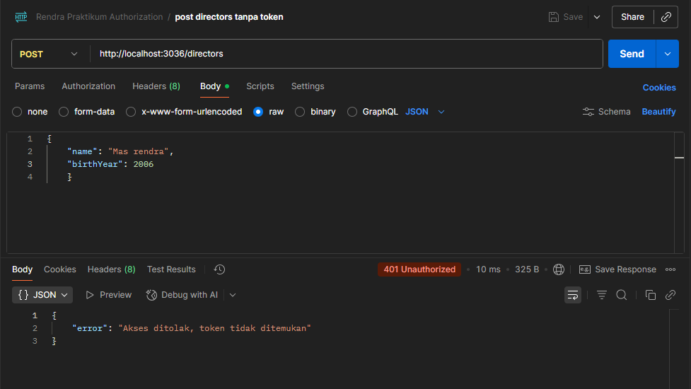
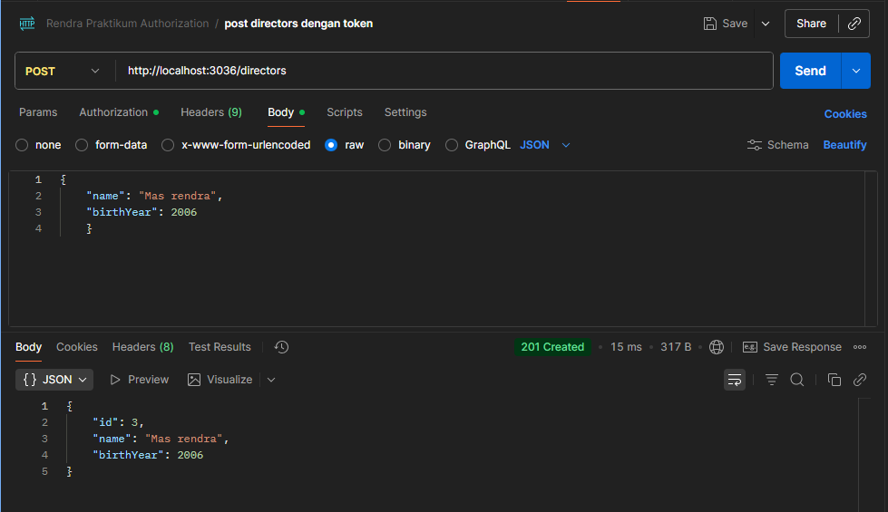
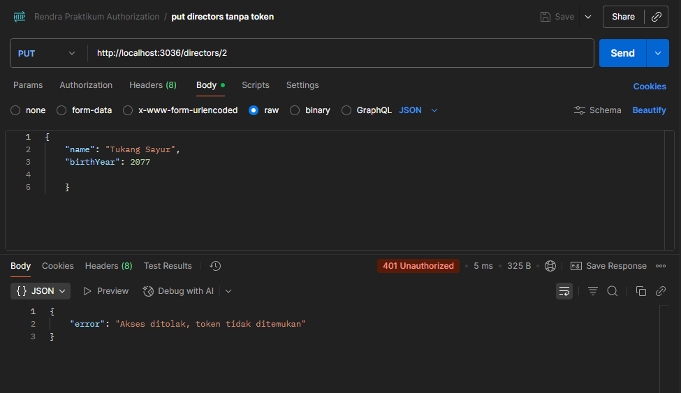
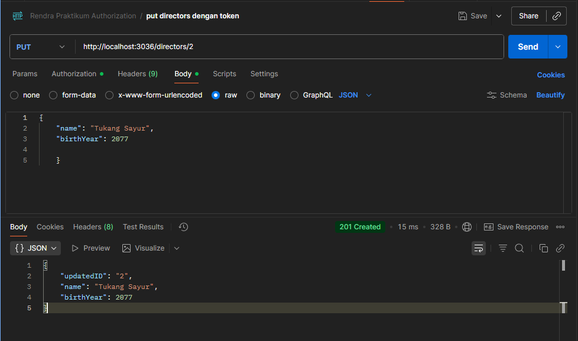
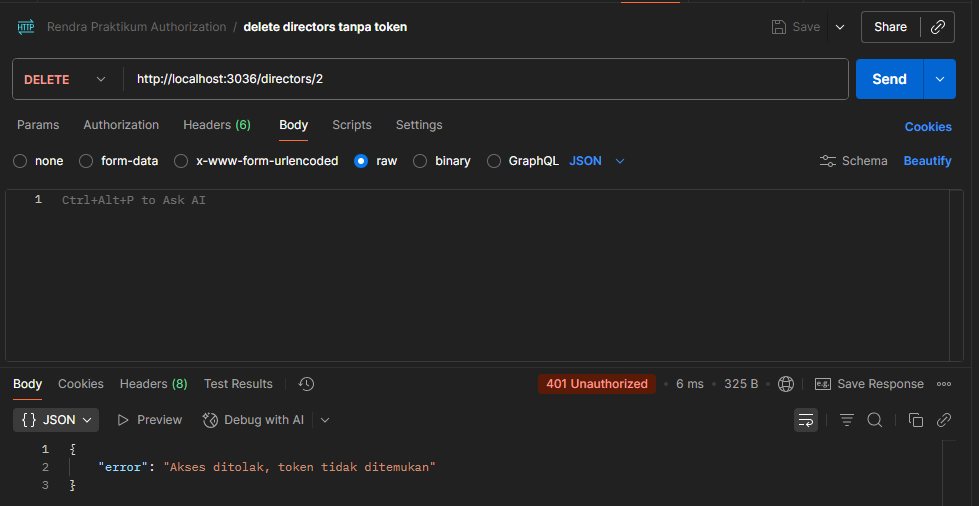
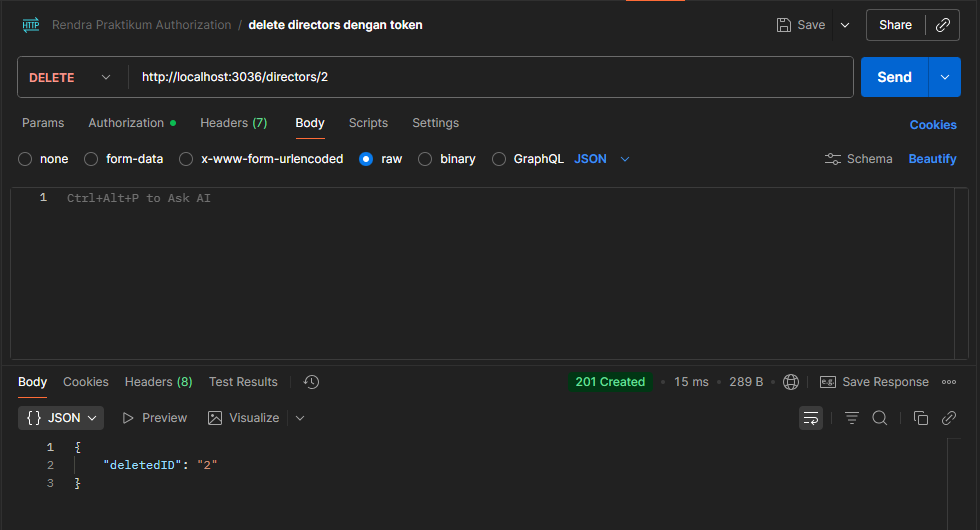

## **Nama**: Muhammad Rendra Irawan_2D TRPL
## **NIM**: 362458302036
## **kelas**: 2D TRPL

### Praktikum 3 || Persistensi Data Saudara
1. Lampiran Json
- 

### Praktikum Modul 5 || PengamananAPI-Autentikasi dan Autorisasi dengan JWT

1. Terapkan middleware ```authenticateToken``` ke endpoint berikut:
- **POST** ```/directors``` tanpa token


- **POST** ```/directors``` dengan token


- **PUT** ```/directors/:id``` tanpa token


- **PUT** ```/directors/:id``` dengan token


- **DELETE** ```/directors/:id``` tanpa token


- **DELETE** ```/directors/:id``` dengan token


2. Biarkan endpoint GET ```/directors``` dan GET ```/directors/:id``` tetap publik.
````
app.get('/directors', (req, res) => {
    const sql = "SELECT * FROM directors ORDER BY id ASC;";
    db.all(sql, [], (err, rows) => {
        if (err) return res.status(400).json({ error: err.message });
        res.json(rows);
    });
});
````

````
app.get('/directors/:id', (req, res) => {
    const sql = "SELECT * FROM directors WHERE id = ?";
    db.get(sql, [req.params.id], (err, row) => {
        if (err) return res.status(400).json({ error: err.message });
        res.json(row);
    });
});
````


3. Lampiran Json
- 